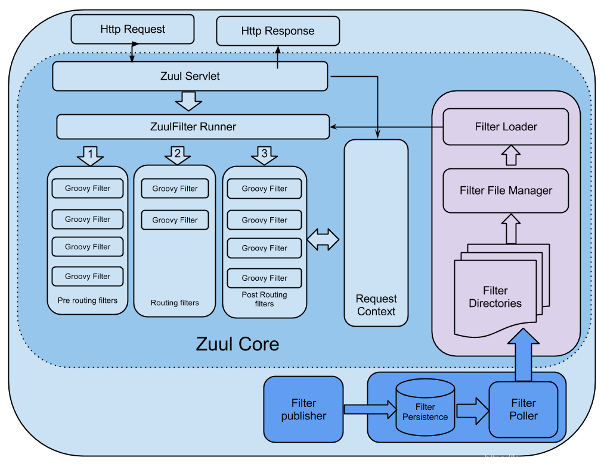

## Zuul架构图


- 首先前端请求发过来会先到 DispatchServlet->ZuulHandlerMapping->zuulController->zuulServlet
- 真正执行方法的是zuulServlet构造函数里的zuulRunner对象，他封装了一个RequestContext，使用ThreadLocal存储请求数据
- zuulRunner里面其实还有FilterProcessor，它可以认为是所有filter的执行器，最终都是执行各自的filter
- zuulServlet首先执行的Pre类型的过滤器，再执行route类型的过滤器，最后执行的是post 类型的过滤器
- 如果在执行这些过滤器有错误的时候则会执行error类型的过滤器。执行完这些过滤器，最终将请求的结果返回给客户端。

## 源码分析

- 首先在入口application类打上@EnableZuulProxy注解
```java
@EnableCircuitBreaker
@EnableDiscoveryClient
@Target({ElementType.TYPE})
@Retention(RetentionPolicy.RUNTIME)
@Import({ZuulProxyConfiguration.class})
public @interface EnableZuulProxy {
}
```

- 接着我们在@import发现引入的ZuulProxyConfiguration，该类注入了DiscoveryClient、RibbonCommandFactoryConfiguration用作负载均衡相关的。

```java
@Configuration
@Import({RibbonCommandFactoryConfiguration.RestClientRibbonConfiguration.class, RibbonCommandFactoryConfiguration.OkHttpRibbonConfiguration.class, RibbonCommandFactoryConfiguration.HttpClientRibbonConfiguration.class})
public class ZuulProxyConfiguration extends ZuulConfiguration {
    @Autowired(
            required = false
    )
    private List<RibbonRequestCustomizer> requestCustomizers = Collections.emptyList();
    @Autowired
    private DiscoveryClient discovery;
    @Autowired
    private ServiceRouteMapper serviceRouteMapper;

    public ZuulProxyConfiguration() {
    }
}
```

- 接着可以发现其父类ZuulConfiguration为我们引入了各种的Filter(Servlet30WrapperFilter)。还有zuulServlet,zuulController

```java
@Configuration
@EnableConfigurationProperties({ZuulProperties.class})
@ConditionalOnClass({ZuulServlet.class})
@Import({ServerPropertiesAutoConfiguration.class})
public class ZuulConfiguration {
    @Autowired
    protected ZuulProperties zuulProperties;
    @Autowired
    protected ServerProperties server;
    @Autowired(
            required = false
    )
    private ErrorController errorController;

    public ZuulConfiguration() {
    }

    @Bean
    public HasFeatures zuulFeature() {
        return HasFeatures.namedFeature("Zuul (Simple)", ZuulConfiguration.class);
    }

    @Bean
    @Primary
    public CompositeRouteLocator primaryRouteLocator(Collection<RouteLocator> routeLocators) {
        return new CompositeRouteLocator(routeLocators);
    }

    @Bean
    @ConditionalOnMissingBean({SimpleRouteLocator.class})
    public SimpleRouteLocator simpleRouteLocator() {
        return new SimpleRouteLocator(this.server.getServletPrefix(), this.zuulProperties);
    }

    @Bean
    public ZuulController zuulController() {
        return new ZuulController();
    }

    @Bean
    public ZuulHandlerMapping zuulHandlerMapping(RouteLocator routes) {
        ZuulHandlerMapping mapping = new ZuulHandlerMapping(routes, this.zuulController());
        mapping.setErrorController(this.errorController);
        return mapping;
    }

    @Bean
    public ApplicationListener<ApplicationEvent> zuulRefreshRoutesListener() {
        return new ZuulRefreshListener();
    }

    @Bean
    @ConditionalOnMissingBean(
            name = {"zuulServlet"}
    )
    public ServletRegistrationBean zuulServlet() {
        ServletRegistrationBean servlet = new ServletRegistrationBean(new ZuulServlet(), new String[]{this.zuulProperties.getServletPattern()});
        servlet.addInitParameter("buffer-requests", "false");
        return servlet;
    }

    @Bean
    public ServletDetectionFilter servletDetectionFilter() {
        return new ServletDetectionFilter();
    }

    @Bean
    public FormBodyWrapperFilter formBodyWrapperFilter() {
        return new FormBodyWrapperFilter();
    }

    @Bean
    public DebugFilter debugFilter() {
        return new DebugFilter();
    }

    @Bean
    public Servlet30WrapperFilter servlet30WrapperFilter() {
        return new Servlet30WrapperFilter();
    }

    @Bean
    public SendResponseFilter sendResponseFilter() {
        return new SendResponseFilter();
    }

    @Bean
    public SendErrorFilter sendErrorFilter() {
        return new SendErrorFilter();
    }

    @Bean
    public SendForwardFilter sendForwardFilter() {
        return new SendForwardFilter();
    }
}
```


## 总结
- 总的来说其实zuul的源码还是比较简单的，本质上是一个巨大的Servlet，然后在servlet执行我们的关键方法init（），preRoute（），route（），postRoute（）；
- 最终执行的是各种ZuulFilter（它有很多默认的Filter），我们也可以通过实现Filter的方式来自定义我们自己的需求，常用的比如日志保存
- 我们可以通过RequestContext很轻松的获取请求类型，参数，返回值这些。


