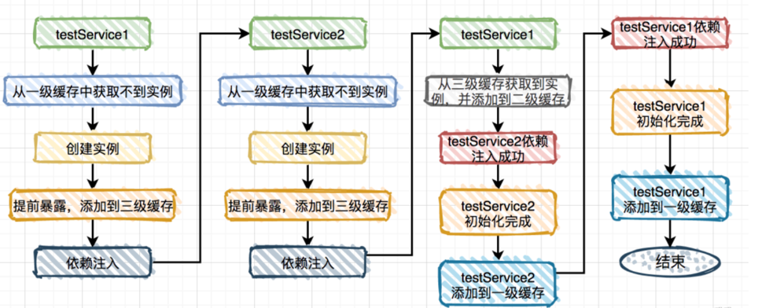

> 众所周知，spring中最核心的概念就是IOC和AOP了，下面我简要分析下IOC的核心源码。既为了学习，也为了不让自己忘记。

## 开始
现在大家都是使用springBoot编程了，我们从入口的SpringApplication.run()->开始
```java
public abstract class AbstractApplicationContext extends DefaultResourceLoader implements ConfigurableApplicationContext, DisposableBean {
    public void refresh() throws BeansException, IllegalStateException {
        synchronized(this.startupShutdownMonitor) {
            // 准备工作，记录容器启动时间之类的
            this.prepareRefresh();
            // 这里是bean生成并注册到beanFactory并封装成beanDefinition存到map的过程
            // 注意：此时的bean还没有实例化只是提取了一些基本信息
            ConfigurableListableBeanFactory beanFactory = this.obtainFreshBeanFactory();
            // 设置 BeanFactory 的类加载器，添加几个 BeanPostProcessor，手动注册几个特殊的 bean
            this.prepareBeanFactory(beanFactory);

            try {
                // 扩展点
                this.postProcessBeanFactory(beanFactory);
                this.invokeBeanFactoryPostProcessors(beanFactory);
                // 扩展点
                this.registerBeanPostProcessors(beanFactory);
                // 国际化相关
                this.initMessageSource();
                this.initApplicationEventMulticaster();
                this.onRefresh();
                this.registerListeners();
                // 这里是重点，所有的singleton bean都是在这里实例化，属性装配，回调等等
                //（lazy-init 的除外）
                this.finishBeanFactoryInitialization(beanFactory);
                // 广播
                this.finishRefresh();
            } catch (BeansException var9) {
                if (this.logger.isWarnEnabled()) {
                    this.logger.warn("Exception encountered during context initialization - cancelling refresh attempt: " + var9);
                }

                this.destroyBeans();
                this.cancelRefresh(var9);
                throw var9;
            } finally {
                this.resetCommonCaches();
            }

        }
    }
}
```
## 实例化Bean
> 这里的核心就是初始化BeanFactory、加载Bean、注册Bean这些操作

// AbstractApplicationContext.java
```java
protected ConfigurableListableBeanFactory obtainFreshBeanFactory() {
   // 关闭旧的 BeanFactory (如果有)，创建新的 BeanFactory，加载 Bean 定义、注册 Bean 等等
   refreshBeanFactory();

   // 返回刚刚创建的 BeanFactory
   ConfigurableListableBeanFactory beanFactory = getBeanFactory();
   if (logger.isDebugEnabled()) {
      logger.debug("Bean factory for " + getDisplayName() + ": " + beanFactory);
   }
   return beanFactory;
}
```
// AbstractRefreshableApplicationContext.java 120
```java
protected final void refreshBeanFactory() throws BeansException {
   // 如果 ApplicationContext 中已经加载过 BeanFactory 了，销毁所有 Bean，关闭 BeanFactory
   // 注意，应用中 BeanFactory 本来就是可以多个的，这里可不是说应用全局是否有 BeanFactory，而是当前
   // ApplicationContext 是否有 BeanFactory
   if (hasBeanFactory()) {
      destroyBeans();
      closeBeanFactory();
   }
   try {
      // 初始化一个 DefaultListableBeanFactory，为什么用这个，我们马上说。
      DefaultListableBeanFactory beanFactory = createBeanFactory();
      // 用于 BeanFactory 的序列化，我想不部分人应该都用不到
      beanFactory.setSerializationId(getId());

      // 下面这两个方法很重要，别跟丢了，具体细节之后说
      // 设置 BeanFactory 的两个配置属性：是否允许 Bean 覆盖、是否允许循环引用
      customizeBeanFactory(beanFactory);

      // 加载 Bean 到 BeanFactory 中
      loadBeanDefinitions(beanFactory);
      synchronized (this.beanFactoryMonitor) {
         this.beanFactory = beanFactory;
      }
   }
   catch (IOException ex) {
      throw new ApplicationContextException("I/O error parsing bean definition source for " + getDisplayName(), ex);
   }
}
```

> 接下来就是customizeBeanFactory和loadBeanDefinitions（）

```java
protected void customizeBeanFactory(DefaultListableBeanFactory beanFactory) {
   if (this.allowBeanDefinitionOverriding != null) {
      // 是否允许 Bean 定义覆盖
      beanFactory.setAllowBeanDefinitionOverriding(this.allowBeanDefinitionOverriding);
   }
   if (this.allowCircularReferences != null) {
      // 是否允许 Bean 间的循环依赖
      beanFactory.setAllowCircularReferences(this.allowCircularReferences);
   }
}
```

> 默认情况下spring是允许循环依赖的，当然这是有条件的。比如构造方法依赖是不允许的

// AbstractXmlApplicationContext.java 80
```java
protected void loadBeanDefinitions(DefaultListableBeanFactory beanFactory) throws BeansException, IOException {
   // 给这个 BeanFactory 实例化一个 XmlBeanDefinitionReader
   XmlBeanDefinitionReader beanDefinitionReader = new XmlBeanDefinitionReader(beanFactory);

   // Configure the bean definition reader with this context's
   // resource loading environment.
   beanDefinitionReader.setEnvironment(this.getEnvironment());
   beanDefinitionReader.setResourceLoader(this);
   beanDefinitionReader.setEntityResolver(new ResourceEntityResolver(this));

   // 初始化 BeanDefinitionReader，其实这个是提供给子类覆写的，
   // 我看了一下，没有类覆写这个方法，我们姑且当做不重要吧
   initBeanDefinitionReader(beanDefinitionReader);
   // 重点来了，继续往下
   loadBeanDefinitions(beanDefinitionReader);
}
```

> 接着执行loadBeanDefinitions最终会将bean封装成definitionBean并放到Map里面
> bean的实例化就完成了，接着调用prepareBeanFactory()准备Bean容器，并注册一些特殊的Bean。

## 初始化所有的singleton
> 调用关键的finishBeanFactoryInitialization(beanFactory)，然后执行preInstantiateSingletons()进行初始化

```java
public void preInstantiateSingletons() throws BeansException {
		if (this.logger.isDebugEnabled()) {
			this.logger.debug("Pre-instantiating singletons in " + this);
		}

		// Iterate over a copy to allow for init methods which in turn register new bean definitions.
		// While this may not be part of the regular factory bootstrap, it does otherwise work fine.
		List<String> beanNames = new ArrayList<String>(this.beanDefinitionNames);

		// Trigger initialization of all non-lazy singleton beans...
		for (String beanName : beanNames) {
			RootBeanDefinition bd = getMergedLocalBeanDefinition(beanName);
        // 非抽象、非懒加载的 singletons。如果配置了 'abstract = true'，那是不需要初始化的
        if (!bd.isAbstract() && bd.isSingleton() && !bd.isLazyInit()) {
                // 处理 FactoryBean
				if (isFactoryBean(beanName)) {
					final FactoryBean<?> factory = (FactoryBean<?>) getBean(FACTORY_BEAN_PREFIX + beanName);
					boolean isEagerInit;
					if (System.getSecurityManager() != null && factory instanceof SmartFactoryBean) {
						isEagerInit = AccessController.doPrivileged(new PrivilegedAction<Boolean>() {
							@Override
							public Boolean run() {
								return ((SmartFactoryBean<?>) factory).isEagerInit();
							}
						}, getAccessControlContext());
					}
					else {
						isEagerInit = (factory instanceof SmartFactoryBean &&
								((SmartFactoryBean<?>) factory).isEagerInit());
					}
					if (isEagerInit) {
						getBean(beanName);
					}
				}
				else {
                    // 普通bean在这里初始化
					getBean(beanName);
				}
			}
		}

		// Trigger post-initialization callback for all applicable beans...
		for (String beanName : beanNames) {
			Object singletonInstance = getSingleton(beanName);
        // 如果我们定义的 bean 是实现了 SmartInitializingSingleton 接口的，在这里得到回调
        if (singletonInstance instanceof SmartInitializingSingleton) {
				final SmartInitializingSingleton smartSingleton = (SmartInitializingSingleton) singletonInstance;
				if (System.getSecurityManager() != null) {
					AccessController.doPrivileged(new PrivilegedAction<Object>() {
						@Override
						public Object run() {
							smartSingleton.afterSingletonsInstantiated();
							return null;
						}
					}, getAccessControlContext());
				}
				else {
					smartSingleton.afterSingletonsInstantiated();
				}
			}
		}
	}
```

> 接着就是看getBean()->doGetBean()

```java
protected <T> T doGetBean(
      final String name, final Class<T> requiredType, final Object[] args, boolean typeCheckOnly)
      throws BeansException {
   // 获取一个 “正统的” beanName，处理两种情况，一个是前面说的 FactoryBean(前面带 ‘&’)，
   // 一个是别名问题，因为这个方法是 getBean，获取 Bean 用的，你要是传一个别名进来，是完全可以的
   final String beanName = transformedBeanName(name);

   // 注意跟着这个，这个是返回值
   Object bean; 

   // 检查下是不是已经创建过了
   Object sharedInstance = getSingleton(beanName);

   // 注意第一次args 传参其实是 null 的，但是如果 args 不为空的时候，那么意味着调用方不是希望获取 Bean，而是创建 Bean
   if (sharedInstance != null && args == null) {
      if (logger.isDebugEnabled()) {
         if (isSingletonCurrentlyInCreation(beanName)) {
            logger.debug("...");
         }
         else {
            logger.debug("Returning cached instance of singleton bean '" + beanName + "'");
         }
      }
      // 下面这个方法：如果是普通 Bean 的话，直接返回 sharedInstance，
      // 如果是 FactoryBean 的话，返回它创建的那个实例对象
      // (FactoryBean 知识，读者若不清楚请移步附录)
      bean = getObjectForBeanInstance(sharedInstance, name, beanName, null);
   }

   else {
      if (isPrototypeCurrentlyInCreation(beanName)) {
         // 创建过了此 beanName 的 prototype 类型的 bean，那么抛异常，
         // 往往是因为陷入了循环引用
         throw new BeanCurrentlyInCreationException(beanName);
      }

      // 检查一下这个 BeanDefinition 在容器中是否存在
      BeanFactory parentBeanFactory = getParentBeanFactory();
      if (parentBeanFactory != null && !containsBeanDefinition(beanName)) {
         // 如果当前容器不存在这个 BeanDefinition，试试父容器中有没有
         String nameToLookup = originalBeanName(name);
         if (args != null) {
            // 返回父容器的查询结果
            return (T) parentBeanFactory.getBean(nameToLookup, args);
         }
         else {
            // No args -> delegate to standard getBean method.
            return parentBeanFactory.getBean(nameToLookup, requiredType);
         }
      }

      if (!typeCheckOnly) {
         // typeCheckOnly 为 false，将当前 beanName 放入一个 alreadyCreated 的 Set 集合中。
         markBeanAsCreated(beanName);
      }

      /*
       * 稍稍总结一下：
       * 到这里的话，要准备创建 Bean 了，对于 singleton 的 Bean 来说，容器中还没创建过此 Bean；
       * 对于 prototype 的 Bean 来说，本来就是要创建一个新的 Bean。
       */
      try {
         final RootBeanDefinition mbd = getMergedLocalBeanDefinition(beanName);
         checkMergedBeanDefinition(mbd, beanName, args);

         // 先初始化依赖的所有 Bean，这个很好理解。
         // 注意，这里的依赖指的是 depends-on 中定义的依赖
         String[] dependsOn = mbd.getDependsOn();
         if (dependsOn != null) {
            for (String dep : dependsOn) {
               // 检查是不是有循环依赖，这里的循环依赖和我们前面说的循环依赖又不一样，这里肯定是不允许出现的，不然要乱套了，读者想一下就知道了
               if (isDependent(beanName, dep)) {
                  throw new BeanCreationException(mbd.getResourceDescription(), beanName,
                        "Circular depends-on relationship between '" + beanName + "' and '" + dep + "'");
               }
               // 注册一下依赖关系
               registerDependentBean(dep, beanName);
               // 先初始化被依赖项
               getBean(dep);
            }
         }

         // 如果是 singleton scope 的，创建 singleton 的实例
         if (mbd.isSingleton()) {
            sharedInstance = getSingleton(beanName, new ObjectFactory<Object>() {
               @Override
               public Object getObject() throws BeansException {
                  try {
                     // 执行创建 Bean，详情后面再说
                     return createBean(beanName, mbd, args);
                  }
                  catch (BeansException ex) {
                     destroySingleton(beanName);
                     throw ex;
                  }
               }
            });
            bean = getObjectForBeanInstance(sharedInstance, name, beanName, mbd);
         }

         // 如果是 prototype scope 的，创建 prototype 的实例
         else if (mbd.isPrototype()) {
            // It's a prototype -> create a new instance.
            Object prototypeInstance = null;
            try {
               beforePrototypeCreation(beanName);
               // 执行创建 Bean
               prototypeInstance = createBean(beanName, mbd, args);
            }
            finally {
               afterPrototypeCreation(beanName);
            }
            bean = getObjectForBeanInstance(prototypeInstance, name, beanName, mbd);
         }

         // 如果不是 singleton 和 prototype 的话，需要委托给相应的实现类来处理
         else {
            String scopeName = mbd.getScope();
            final Scope scope = this.scopes.get(scopeName);
            if (scope == null) {
               throw new IllegalStateException("No Scope registered for scope name '" + scopeName + "'");
            }
            try {
               Object scopedInstance = scope.get(beanName, new ObjectFactory<Object>() {
                  @Override
                  public Object getObject() throws BeansException {
                     beforePrototypeCreation(beanName);
                     try {
                        // 执行创建 Bean
                        return createBean(beanName, mbd, args);
                     }
                     finally {
                        afterPrototypeCreation(beanName);
                     }
                  }
               });
               bean = getObjectForBeanInstance(scopedInstance, name, beanName, mbd);
            }
            catch (IllegalStateException ex) {
               throw new BeanCreationException(beanName,
                     "Scope '" + scopeName + "' is not active for the current thread; consider " +
                     "defining a scoped proxy for this bean if you intend to refer to it from a singleton",
                     ex);
            }
         }
      }
      catch (BeansException ex) {
         cleanupAfterBeanCreationFailure(beanName);
         throw ex;
      }
   }

   // 最后，检查一下类型对不对，不对的话就抛异常，对的话就返回了
   if (requiredType != null && bean != null && !requiredType.isInstance(bean)) {
      try {
         return getTypeConverter().convertIfNecessary(bean, requiredType);
      }
      catch (TypeMismatchException ex) {
         if (logger.isDebugEnabled()) {
            logger.debug("Failed to convert bean '" + name + "' to required type '" +
                  ClassUtils.getQualifiedName(requiredType) + "'", ex);
         }
         throw new BeanNotOfRequiredTypeException(name, requiredType, bean.getClass());
      }
   }
   return (T) bean;
}
```
> 显然接下来就是createBean()->doCreateBean()了

```java
protected Object doCreateBean(final String beanName, final RootBeanDefinition mbd, final Object[] args)
      throws BeanCreationException {

   // Instantiate the bean.
   BeanWrapper instanceWrapper = null;
   if (mbd.isSingleton()) {
      instanceWrapper = this.factoryBeanInstanceCache.remove(beanName);
   }
   if (instanceWrapper == null) {
      // 说明不是 FactoryBean，这里实例化 Bean，这里非常关键，细节之后再说
      instanceWrapper = createBeanInstance(beanName, mbd, args);
   }
   // 这个就是 Bean 里面的 我们定义的类 的实例，很多地方我直接描述成 "bean 实例"
   final Object bean = (instanceWrapper != null ? instanceWrapper.getWrappedInstance() : null);
   // 类型
   Class<?> beanType = (instanceWrapper != null ? instanceWrapper.getWrappedClass() : null);
   mbd.resolvedTargetType = beanType;

   // 建议跳过吧，涉及接口：MergedBeanDefinitionPostProcessor
   synchronized (mbd.postProcessingLock) {
      if (!mbd.postProcessed) {
         try {
            // MergedBeanDefinitionPostProcessor，这个我真不展开说了，直接跳过吧，很少用的
            applyMergedBeanDefinitionPostProcessors(mbd, beanType, beanName);
         }
         catch (Throwable ex) {
            throw new BeanCreationException(mbd.getResourceDescription(), beanName,
                  "Post-processing of merged bean definition failed", ex);
         }
         mbd.postProcessed = true;
      }
   }

   // Eagerly cache singletons to be able to resolve circular references
   // even when triggered by lifecycle interfaces like BeanFactoryAware.
   // 下面这块代码是为了解决循环依赖的问题，以后有时间，我再对循环依赖这个问题进行解析吧
   boolean earlySingletonExposure = (mbd.isSingleton() && this.allowCircularReferences &&
         isSingletonCurrentlyInCreation(beanName));
   if (earlySingletonExposure) {
      if (logger.isDebugEnabled()) {
         logger.debug("Eagerly caching bean '" + beanName +
               "' to allow for resolving potential circular references");
      }
      addSingletonFactory(beanName, new ObjectFactory<Object>() {
         @Override
         public Object getObject() throws BeansException {
            return getEarlyBeanReference(beanName, mbd, bean);
         }
      });
   }

   // Initialize the bean instance.
   Object exposedObject = bean;
   try {
      // 这一步也是非常关键的，这一步负责属性装配，因为前面的实例只是实例化了，并没有设值，这里就是设值
      populateBean(beanName, mbd, instanceWrapper);
      if (exposedObject != null) {
         // 还记得 init-method 吗？还有 InitializingBean 接口？还有 BeanPostProcessor 接口？
         // 这里就是处理 bean 初始化完成后的各种回调
         exposedObject = initializeBean(beanName, exposedObject, mbd);
      }
   }
   catch (Throwable ex) {
      if (ex instanceof BeanCreationException && beanName.equals(((BeanCreationException) ex).getBeanName())) {
         throw (BeanCreationException) ex;
      }
      else {
         throw new BeanCreationException(
               mbd.getResourceDescription(), beanName, "Initialization of bean failed", ex);
      }
   }

   if (earlySingletonExposure) {
      // 
      Object earlySingletonReference = getSingleton(beanName, false);
      if (earlySingletonReference != null) {
         if (exposedObject == bean) {
            exposedObject = earlySingletonReference;
         }
         else if (!this.allowRawInjectionDespiteWrapping && hasDependentBean(beanName)) {
            String[] dependentBeans = getDependentBeans(beanName);
            Set<String> actualDependentBeans = new LinkedHashSet<String>(dependentBeans.length);
            for (String dependentBean : dependentBeans) {
               if (!removeSingletonIfCreatedForTypeCheckOnly(dependentBean)) {
                  actualDependentBeans.add(dependentBean);
               }
            }
            if (!actualDependentBeans.isEmpty()) {
               throw new BeanCurrentlyInCreationException(beanName,
                     "Bean with name '" + beanName + "' has been injected into other beans [" +
                     StringUtils.collectionToCommaDelimitedString(actualDependentBeans) +
                     "] in its raw version as part of a circular reference, but has eventually been " +
                     "wrapped. This means that said other beans do not use the final version of the " +
                     "bean. This is often the result of over-eager type matching - consider using " +
                     "'getBeanNamesOfType' with the 'allowEagerInit' flag turned off, for example.");
            }
         }
      }
   }

   // Register bean as disposable.
   try {
      registerDisposableBeanIfNecessary(beanName, bean, mbd);
   }
   catch (BeanDefinitionValidationException ex) {
      throw new BeanCreationException(
            mbd.getResourceDescription(), beanName, "Invalid destruction signature", ex);
   }

   return exposedObject;
}
```

> doCreateBean方法是重点中的重点，因为它包含三个最关键的方法

- 实例化bean - createBeanInstance（）
```java
protected BeanWrapper createBeanInstance(String beanName, RootBeanDefinition mbd, Object[] args) {
		// Make sure bean class is actually resolved at this point.
		Class<?> beanClass = resolveBeanClass(mbd, beanName);

		if (beanClass != null && !Modifier.isPublic(beanClass.getModifiers()) && !mbd.isNonPublicAccessAllowed()) {
			throw new BeanCreationException(mbd.getResourceDescription(), beanName,
					"Bean class isn't public, and non-public access not allowed: " + beanClass.getName());
		}

		if (mbd.getFactoryMethodName() != null)  {
			return instantiateUsingFactoryMethod(beanName, mbd, args);
		}

		// Shortcut when re-creating the same bean...
		boolean resolved = false;
		boolean autowireNecessary = false;
		if (args == null) {
			synchronized (mbd.constructorArgumentLock) {
				if (mbd.resolvedConstructorOrFactoryMethod != null) {
					resolved = true;
					autowireNecessary = mbd.constructorArgumentsResolved;
				}
			}
		}
		if (resolved) {
			if (autowireNecessary) {
				return autowireConstructor(beanName, mbd, null, null);
			}
			else {
				return instantiateBean(beanName, mbd);
			}
		}

		// Need to determine the constructor...
		Constructor<?>[] ctors = determineConstructorsFromBeanPostProcessors(beanClass, beanName);
		if (ctors != null ||
				mbd.getResolvedAutowireMode() == RootBeanDefinition.AUTOWIRE_CONSTRUCTOR ||
				mbd.hasConstructorArgumentValues() || !ObjectUtils.isEmpty(args))  {
        // 构造函数依赖注入
        return autowireConstructor(beanName, mbd, ctors, args);
		}

		// No special handling: simply use no-arg constructor.
        // 调用无参构造函数
        return instantiateBean(beanName, mbd);
	}
```
> 调用instantiate方法完成实例化，如果不存在方法覆写，那就使用 java 反射进行实例化，否则使用 CGLIB。
- 属性装配 - populateBean（）
```java
protected void populateBean(String beanName, RootBeanDefinition mbd, BeanWrapper bw) {
   // bean 实例的所有属性都在这里了
   PropertyValues pvs = mbd.getPropertyValues();

   if (bw == null) {
      if (!pvs.isEmpty()) {
         throw new BeanCreationException(
               mbd.getResourceDescription(), beanName, "Cannot apply property values to null instance");
      }
      else {
         // Skip property population phase for null instance.
         return;
      }
   }

   // 到这步的时候，bean 实例化完成（通过工厂方法或构造方法），但是还没开始属性设值，
   // InstantiationAwareBeanPostProcessor 的实现类可以在这里对 bean 进行状态修改，
   // 我也没找到有实际的使用，所以我们暂且忽略这块吧
   boolean continueWithPropertyPopulation = true;
   if (!mbd.isSynthetic() && hasInstantiationAwareBeanPostProcessors()) {
      for (BeanPostProcessor bp : getBeanPostProcessors()) {
         if (bp instanceof InstantiationAwareBeanPostProcessor) {
            InstantiationAwareBeanPostProcessor ibp = (InstantiationAwareBeanPostProcessor) bp;
            // 如果返回 false，代表不需要进行后续的属性设值，也不需要再经过其他的 BeanPostProcessor 的处理
            if (!ibp.postProcessAfterInstantiation(bw.getWrappedInstance(), beanName)) {
               continueWithPropertyPopulation = false;
               break;
            }
         }
      }
   }

   if (!continueWithPropertyPopulation) {
      return;
   }

   if (mbd.getResolvedAutowireMode() == RootBeanDefinition.AUTOWIRE_BY_NAME ||
         mbd.getResolvedAutowireMode() == RootBeanDefinition.AUTOWIRE_BY_TYPE) {
      MutablePropertyValues newPvs = new MutablePropertyValues(pvs);

      // 通过名字找到所有属性值，如果是 bean 依赖，先初始化依赖的 bean。记录依赖关系
      if (mbd.getResolvedAutowireMode() == RootBeanDefinition.AUTOWIRE_BY_NAME) {
         autowireByName(beanName, mbd, bw, newPvs);
      }

      // 通过类型装配
      if (mbd.getResolvedAutowireMode() == RootBeanDefinition.AUTOWIRE_BY_TYPE) {
         autowireByType(beanName, mbd, bw, newPvs);
      }

      pvs = newPvs;
   }

   boolean hasInstAwareBpps = hasInstantiationAwareBeanPostProcessors();
   boolean needsDepCheck = (mbd.getDependencyCheck() != RootBeanDefinition.DEPENDENCY_CHECK_NONE);

   if (hasInstAwareBpps || needsDepCheck) {
      PropertyDescriptor[] filteredPds = filterPropertyDescriptorsForDependencyCheck(bw, mbd.allowCaching);
      if (hasInstAwareBpps) {
         for (BeanPostProcessor bp : getBeanPostProcessors()) {
            if (bp instanceof InstantiationAwareBeanPostProcessor) {
               InstantiationAwareBeanPostProcessor ibp = (InstantiationAwareBeanPostProcessor) bp;
               // 这里有个非常有用的 BeanPostProcessor 进到这里: AutowiredAnnotationBeanPostProcessor
               // 对采用 @Autowired、@Value 注解的依赖进行设值，这里的内容也是非常丰富的，不过本文不会展开说了，感兴趣的读者请自行研究
               pvs = ibp.postProcessPropertyValues(pvs, filteredPds, bw.getWrappedInstance(), beanName);
               if (pvs == null) {
                  return;
               }
            }
         }
      }
      if (needsDepCheck) {
         checkDependencies(beanName, mbd, filteredPds, pvs);
      }
   }
   // 设置 bean 实例的属性值
   applyPropertyValues(beanName, mbd, bw, pvs);
}
```
- 初始化后的回调 - initializeBean()
```java
protected Object initializeBean(final String beanName, final Object bean, RootBeanDefinition mbd) {
   if (System.getSecurityManager() != null) {
      AccessController.doPrivileged(new PrivilegedAction<Object>() {
         @Override
         public Object run() {
            invokeAwareMethods(beanName, bean);
            return null;
         }
      }, getAccessControlContext());
   }
   else {
      // 如果 bean 实现了 BeanNameAware、BeanClassLoaderAware 或 BeanFactoryAware 接口，回调
      invokeAwareMethods(beanName, bean);
   }

   Object wrappedBean = bean;
   if (mbd == null || !mbd.isSynthetic()) {
      // BeanPostProcessor 的 postProcessBeforeInitialization 回调
      wrappedBean = applyBeanPostProcessorsBeforeInitialization(wrappedBean, beanName);
   }

   try {
         // 如果 bean 实现了 InitializingBean 接口，调用 afterPropertiesSet() 方法
        // 处理 bean 中定义的 init-method
        invokeInitMethods(beanName, wrappedBean, mbd);
   }
   catch (Throwable ex) {
      throw new BeanCreationException(
            (mbd != null ? mbd.getResourceDescription() : null),
            beanName, "Invocation of init method failed", ex);
   }

   if (mbd == null || !mbd.isSynthetic()) {
      // BeanPostProcessor 的 postProcessAfterInitialization 回调
      wrappedBean = applyBeanPostProcessorsAfterInitialization(wrappedBean, beanName);
   }
   return wrappedBean;
}
```

> 至此也算分析完了，当然还有很多的细节没有深入，这只是大概

## 总结

> 不得不惊叹Spring是如此的复杂，而我这分析的只是冰山一角。主要是分支太多了，有时候自己都会绕晕。我大概梳理了一下流程:

- 初始化容器BeanFactory
- 封装bean对象DefinitionBean并注册到容器Map
- 设置beanFactory的类加载器注册一些容器自带的bean（Environment等等）
- 如果bean实现了BeanFactoryPostProcessor接口调用postProcessBeanFactory，invokeBeanFactoryPostProcessors
- 如果bean实现了BeanPostProcessor会注册
- 接着就是核心的finishBeanFactoryInitialization（）
  - 实例化bean createBeanInstance
  - 属性装配 populateBean
  - 各种回调 initializeBean

> 同时我们也可以引出许多问题，比如Spring是怎么解决循环依赖的？Spring有哪些扩展点？@PostConstruct，init-method，afterPropertiesSet执行顺序等等

 - 三级缓存问题
   - 一级缓存： singletonObjects存储的是所有创建好了的单例Bean
   - 二级缓存：earlySingletonObjects完成实例化，但是还未进行属性注入及初始化的对象
   - 三级缓存：singletonFactories提前暴露的一个单例工厂，二级缓存中存储的就是从这个工厂中获取到的对象。
     
   
 - 执行顺序 @PostConstruct > afterPropertiesSet() > initMethod()
 - Spring有哪些扩展点？
   - ApplicationContextInitializer
   - BeanFactoryPostProcessor
   - BeanDefinitionRegistryPostProcessor
   - InstantiationAwareBeanPostProcessor
   - SmartInstantiationAwareBeanPostProcessor
   - BeanFactoryAware
   - ApplicationContextAwareProcessor
   - BeanNameAware
   - @PostConstruct，afterPropertiesSet，initMethod
   - InitializingBean
   - DisposableBean
   - ==


 